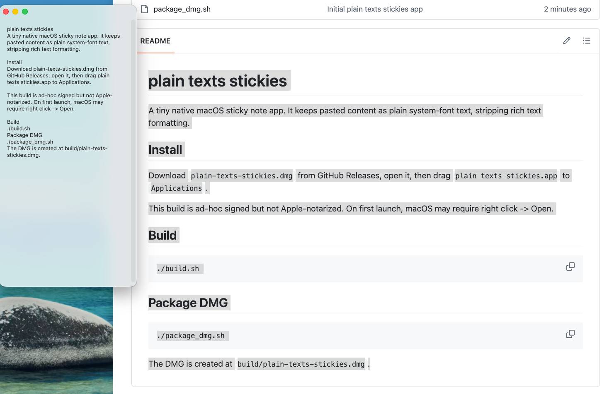

# plain texts stickies

Native macOS sticky notes that always paste as plain system-font text.

[Download the latest DMG](https://github.com/Antoniaiaiaiaia/plain-texts-stickies/releases/latest/download/plain-texts-stickies.dmg)



## Why

macOS Stickies is handy, but pasted web pages, docs, and chat messages often drag in fonts, colors, links, and spacing. plain texts stickies keeps the sticky-note workflow and strips pasted content down to clean plain text.

## Features

- Native macOS AppKit app.
- Paste and drop content as plain text.
- System default font by default.
- `Command +` / `Command -` to change note font size.
- Translucent glass note windows.
- Local autosave with no account, sync, or network calls.

## Install

1. Download `plain-texts-stickies.dmg` from [GitHub Releases](https://github.com/Antoniaiaiaiaia/plain-texts-stickies/releases/latest).
2. Open the DMG.
3. Drag `plain texts stickies.app` into `Applications`.

This build is ad-hoc signed but not Apple-notarized. On first launch, macOS may require right click -> Open.

## Build

```bash
./build.sh
```

## Package DMG

```bash
./package_dmg.sh
```

The DMG is created at `build/plain-texts-stickies.dmg`.
